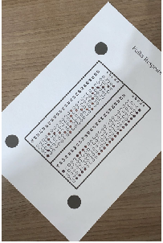
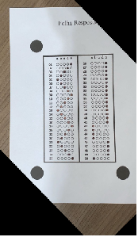
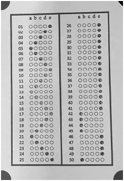
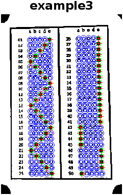

# 📝 Optical Mark Recognition (OMR) in MATLAB

This project implements an **Optical Mark Recognition (OMR)** system using MATLAB.  
It automatically detects and identifies filled answer bubbles 🟤 on scanned multiple-choice exam sheets using image processing techniques.

## 🚀 Features

- 🔍 Automatic detection of answer areas  
- 📐 Skew correction using reference marks  
- 🎛️ Grayscale conversion, binarization & segmentation  
- 🧩 Analysis of connected components  
- 🔵 Circularity-based recognition of marked answers

## 🛠️ Technologies Used

- 🧠 MATLAB  
- 🧰 Image Processing Toolbox

## ⚙️ How It Works

1. 📂 **Image Input:** Loads scanned images of the provided template.
2. 📏 **Skew Correction:** Aligns the image using reference marks.
3. 🖤 **Preprocessing:** Converts to grayscale and applies binarization (e.g., Otsu’s method).  
4. 🧱 **Segmentation:** Identifies connected components.
5. 🧠 **Recognition:** Detects filled bubbles based on area and circularity.

## 💬 Image examples

  
  ➜
  
  ➜
  
  ➜
  

## ▶️ How to Run

1. 📥 Open MATLAB.  
2. 📁 Clone this repository and navigate to the project folder.  
3. 🏃‍♂️ Run `main.m` to start the OMR process.

## 📄 License

This project is for **educational purposes only**. 🎓
